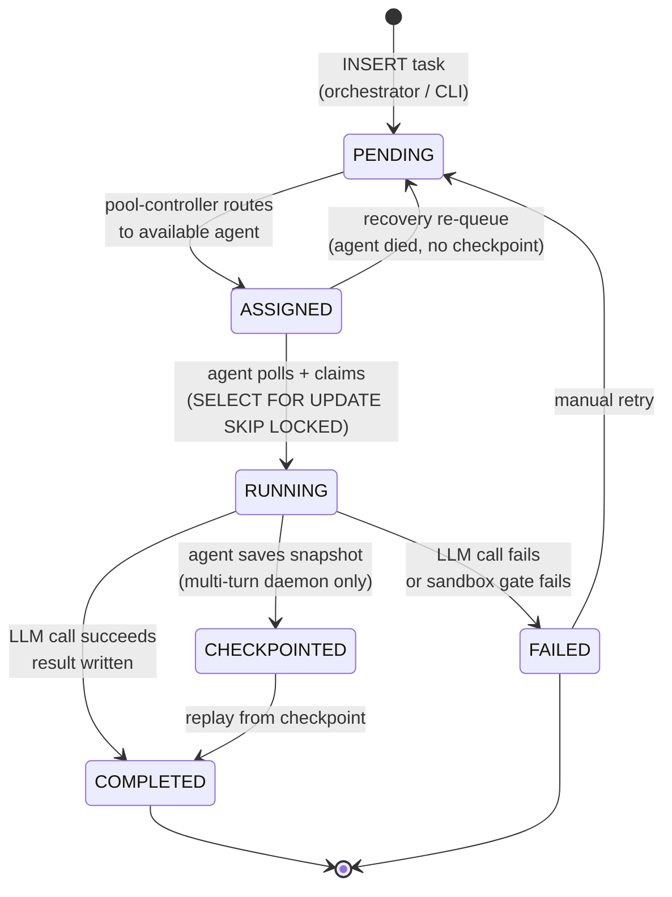

# RASA — Reliable Autonomous System of Agents

Multi-agent orchestration platform for a single-node lab machine. Agents are soul-driven Python workers; the control plane is Go; PostgreSQL is the durable message bus.

**Hardware target:** Intel Ultra 7 255, 64 GB RAM, RTX 5060 8 GB, 1 TB SSD
**Phase:** Pilot (all 5 implementation gates complete)

---

## Architecture

### Object Flowmap

```mermaid
graph TD
    %% Orchestrator
    ORCH["🔧 Orchestrator CLI<br/>(Go)"]
    TASK["📋 Task<br/>id, soul_id, title, goal, status"]
    ORCH -->|"INSERT tasks +<br/>PG NOTIFY tasks_assigned"| ORCHDB

    %% PostgreSQL — rasa_orch
    ORCHDB[("🐘 rasa_orch<br/>tasks, bus_messages, checkpoint_refs")]
    ORCHDB -->|"LISTEN/NOTIFY<br/>tasks_assigned"| POOL

    %% Pool Controller
    POOL["🏊 Pool Controller<br/>(Go)"]
    AGENT_REG["🗂️ Agent Registry<br/>agent_id → soul_id, state"]
    POOL -->|"upsert"| AGENT_REG
    POOL -->|"UPDATE tasks<br/>SET assigned_agent_id, assigned_at"| ORCHDB

    %% Agent Runtime
    AGENT["🤖 Agent Runtime<br/>(Python)"]
    SOUL["📜 Soul Sheet<br/>(YAML: role, model, prompt template)"]
    AGENT -->|"loads"| SOUL
    AGENT -->|"poll: SELECT FOR UPDATE SKIP LOCKED"| ORCHDB
    AGENT -->|"UPDATE status=RUNNING"| ORCHDB

    %% Redis heartbeat
    REDIS[("⚡ Redis<br/>Pub/Sub + cache")]
    AGENT -->|"PUBLISH heartbeat<br/>every 5s"| REDIS
    REDIS -->|"PSUBSCRIBE agents.heartbeat.*"| POOL
    REDIS -->|"PSUBSCRIBE agents.heartbeat.*"| RECOV

    %% Memory Subsystem
    MEM["🧠 Memory Controller<br/>(Go) :8300"]
    MEMDB[("🐘 rasa_memory<br/>canonical_nodes, embeddings, session_store")]
    AGENT -->|"HTTP POST /assemble<br/>soul_id, task_id, variables"| MEM
    MEM -->|"reads/writes"| MEMDB

    %% LLM Gateway
    GATEWAY["🌐 LLM Gateway<br/>(Python) :11434"]
    GWCACHE[("⚡ Redis<br/>SHA-256 prompt cache")]
    AGENT -->|"complete(system_prompt, tier)"| GATEWAY
    GATEWAY -->|"cache check"| GWCACHE
    GATEWAY -->|"Deepseek Cloud API"| LLM[("☁️ LLM Cloud")]
    GATEWAY -->|"cache write"| GWCACHE

    %% Sandbox Pipeline
    SANDBOX["🔒 Sandbox Pipeline<br/>(Python)"]
    SANDBOXDIR["📁 data/sandbox/<br/>clone → scan → build → test → promote"]
    AGENT -->|"PG NOTIFY sandbox_execute"| SANDBOX
    SANDBOX -->|"isolated subprocess in temp dir"| SANDBOXDIR
    SANDBOX -->|"PG NOTIFY sandbox_result"| ORCHDB

    %% Evaluation Engine
    EVAL["📊 Eval Aggregator<br/>(Go)"]
    EVALDB[("🐘 rasa_eval<br/>evaluation_records, drift_snapshots")]
    SCORER["🎯 Eval Scorer<br/>(Python)"]
    SCORER -->|"score_result() → eval_record<br/>PG NOTIFY eval_record"| EVAL
    EVAL -->|"INSERT evaluation_records"| EVALDB
    EVAL -->|"snapshot every 60s<br/>INSERT drift_snapshots"| EVALDB
    EVAL -->|"drift alert<br/>if mean < 0.6 over 20-task window"| LOGS

    %% Recovery Controller
    RECOV["🔄 Recovery Controller<br/>(Go)"]
    RECOVDB[("🐘 rasa_recovery<br/>recovery_log, idempotency_ledger")]
    RECOV -->|"detect dead agent<br/>> 30s no heartbeat"| REDIS
    RECOV -->|"re-queue task → PENDING<br/>write recovery_log"| RECOVDB
    RECOV -->|"idempotency guard<br/>ON CONFLICT key_hash"| RECOVDB

    %% Policy Engine
    POLICY["⚖️ Policy Engine<br/>(Go)"]
    POLDB[("🐘 rasa_policy<br/>rules, audit_log, human_reviews")]
    POLICY -->|"evaluate allow/deny/review"| POLDB

    %% Pool saturation tracking
    POOL -->|"INSERT backpressure_events<br/>when no agent for soul"| POOLDB
    POOLDB[("🐘 rasa_pool<br/>agents, heartbeats, backpressure_events")]
    POOL -->|"INSERT heartbeats + agents<br/>ON CONFLICT upsert"| POOLDB

    %% Observability Dashboard
    OBSERVE["📺 observe.py<br/>Live terminal dashboard"]
    LOGS["📋 Structured JSON logs"]
    OBSERVE -->|"queries views every 30s"| ORCHDB
    OBSERVE -->|"queries views"| EVALDB
    OBSERVE -->|"queries views"| POOLDB
    OBSERVE -->|"queries views"| RECOVDB
    OBSERVE -->|"queries views"| POLDB
```



### Task State Machine



### Key Design Decisions

- **PostgreSQL** is the sole durable bus — LISTEN/NOTIFY + backing tables. No NATS.
- **Redis** is ephemeral only — heartbeats, session cache, policy Pub/Sub.
- **6 databases**: `rasa_orch`, `rasa_pool`, `rasa_policy`, `rasa_memory`, `rasa_eval`, `rasa_recovery`

---

## Prerequisites

| Component | Version | Install |
|-----------|---------|---------|
| Python | 3.12+ | `.\scripts\setup_windows.ps1` or MS Store |
| Go | 1.24+ | `winget install GoLang.Go` |
| PostgreSQL | 16+ | `winget install PostgreSQL` |
| Redis | 7.x | `winget install Redis` |
| Git | 2.40+ | `winget install Git.Git` |
| honcho | latest | `pip install honcho` (Process management) |

Ollama is optional — the LLM Gateway routes to Ollama Cloud (`Deepseek-v4-flash:cloud` / `Deepseek-v4-pro:cloud`) by default.

---

## Installation

### 1. Clone

```powershell
git clone https://github.com/goldfly1/rasa.git
cd rasa
```

### 2. Python environment

```powershell
python -m venv .venv
.venv\Scripts\python.exe -m pip install --upgrade pip
.venv\Scripts\python.exe -m pip install -e ".[dev]"
```

### 3. Go control plane

```bash
go build ./cmd/...
```

This produces binaries in the current directory for each service (`pool-controller.exe`, `policy-engine.exe`, etc.).

### 4. PostgreSQL databases

```powershell
.\scripts\create_databases.ps1      # Creates all 6 databases
.\scripts\bootstrap_schema.ps1      # Applies all migrations (including metrics views)
```

Or apply migrations individually:

```bash
psql -U postgres -f migrations/010_rasa_orch.sql
psql -U postgres -f migrations/070_metrics_views.sql
# ... etc
```

### 5. Environment

Create a `.env` file in the project root (never committed):

```
RASA_DB_PASSWORD=your_postgres_password
```

All other variables have defaults (see [Environment Variables](#environment-variables) below).

### 6. Verify

```bash
# Python imports
.venv/Scripts/python.exe -c "import rasa; print('Python OK')"

# Go binaries exist
ls *.exe

# Databases reachable
psql -U postgres -d rasa_orch -c "SELECT 1"
psql -U postgres -d rasa_eval -c "SELECT * FROM v_soul_performance LIMIT 0"

# Redis pings
redis-cli ping
```

---

## Running the Stack

### Everything at once

```bash
honcho start
```

This launches all services defined in `Procfile`: Redis, pool-controller, policy-engine, recovery-controller, eval-aggregator, memory-controller, LLM gateway, sandbox pipeline, eval-scorer, 5 agent processes, and the observe dashboard. **Ctrl-C shuts it all down.**

### Individual services

```bash
honcho start redis              # Infrastructure
honcho start pool-controller    # Go control plane
honcho start llm-gateway        # Python: LLM routing + caching
honcho start agent-coder        # Python: single agent
honcho start sandbox            # Python: sandbox pipeline
honcho start logs               # observe.py dashboard
```

### Submitting a task

```bash
# Via orchestrator CLI (Go)
./orchestrator submit --soul coder-v2-dev --title "Refactor DB layer" --wait

# Via Python one-shot (no orchestrator required)
.venv/Scripts/python.exe -m rasa.agent.dispatcher --soul coder-v2-dev --goal "Return OK" --one-shot
```

### Running agents standalone

```bash
.venv/Scripts/python.exe -m rasa.agent.runtime --soul souls/coder-v2-dev.yaml
```

Each agent registers with the pool controller, sends heartbeats every 5s, polls for tasks assigned to it, executes via the LLM Gateway, and writes results to PostgreSQL.

---

## Adding a New Agent

1. Create a soul sheet (copy an existing one):
```
cp souls/coder-v2-dev.yaml souls/my-agent-v1.yaml
```

2. Edit `souls/my-agent-v1.yaml` — change `soul_id`, `agent_role`, prompt template, model tier.

3. Add a Procfile entry:
```
agent-mine: python -m rasa.agent.runtime --soul souls/my-agent-v1.yaml
```

4. Optionally add it to `config/pool.yaml` for pool-controller sizing.

5. Test dry-run (no LLM call):
```bash
.venv/Scripts/python.exe -m rasa.agent.dispatcher --soul my-agent-v1 --goal "Test" --dry-run
```

---

## Metrics & Observability

RASA writes metrics to database tables in real time. Every component has a durable audit trail — no log-parsing required.

### Live dashboard

```bash
# Continuous refresh (every 30s)
.venv/Scripts/python.exe scripts/observe.py

# One snapshot
.venv/Scripts/python.exe scripts/observe.py --once

# Custom interval
.venv/Scripts/python.exe scripts/observe.py --interval 15
```

The dashboard shows:
- **Tasks** (24h): status breakdown, success rate, sparkline bars
- **Agents**: per-agent state, last heartbeat, uptime, heartbeat coverage
- **Soul performance** (7d): avg score, pass rate, avg latency, low-score count
- **Drift status**: per-soul rolling window mean/std with drift alerts
- **Backpressure events** (1h): when no agent is available for a soul
- **Recovery actions** (24h): re-queues, checkpoint discoveries
- **Policy decisions** (24h): allow/deny/review counts

### SQL views (query directly)

All views are created by `migrations/070_metrics_views.sql`:

| Database | View | What |
|----------|------|------|
| `rasa_orch` | `v_task_latency` | Queue/pickup/exec time per task (30d) |
| `rasa_orch` | `v_daily_summary` | Tasks per day, avg latency (30d) |
| `rasa_eval` | `v_soul_performance` | Avg score, pass rate per soul (7d) |
| `rasa_eval` | `v_latest_drift` | Most recent drift snapshot per soul |
| `rasa_pool` | `v_agent_uptime` | Heartbeat coverage + liveness per agent |
| `rasa_pool` | `v_recent_backpressure` | Saturation events (1h window) |
| `rasa_policy` | `v_recent_decisions` | Policy decisions per hour (24h) |
| `rasa_recovery` | `v_recent_recoveries` | Recovery actions per hour (24h) |

Query examples:

```bash
# Which souls are drifting?
psql -U postgres -d rasa_eval -c "SELECT * FROM v_latest_drift WHERE flagged = true;"

# Task success rate today
psql -U postgres -d rasa_orch -c "SELECT * FROM v_daily_summary WHERE day = CURRENT_DATE;"

# Any agents gone quiet?
psql -U postgres -d rasa_pool -c "SELECT * FROM v_agent_uptime WHERE liveness = 'UNRESPONSIVE';"

# Soul scoreboard
psql -U postgres -d rasa_eval -c "SELECT soul_id, task_count, avg_score, pass_rate FROM v_soul_performance;"
```

### Raw tables

Every component writes to its own database:

| Database | Key Tables |
|----------|------------|
| `rasa_orch` | `tasks`, `audit_log`, `bus_messages` |
| `rasa_pool` | `agents`, `heartbeats`, `backpressure_events` |
| `rasa_eval` | `evaluation_records`, `drift_snapshots` |
| `rasa_recovery` | `recovery_log`, `idempotency_ledger` |
| `rasa_policy` | `audit_log`, `human_reviews` |
| `rasa_memory` | `canonical_nodes`, `embeddings`, `session_store` |

Ad-hoc digging:

```bash
# Recent recoveries
psql -U postgres -d rasa_recovery -c "SELECT * FROM recovery_log ORDER BY created_at DESC LIMIT 10;"

# Backpressure timeline
psql -U postgres -d rasa_pool -c "SELECT * FROM backpressure_events ORDER BY triggered_at DESC LIMIT 20;"

# Heartbeat history for an agent
psql -U postgres -d rasa_pool -c "SELECT agent_id, COUNT(*), MAX(received_at) FROM heartbeats GROUP BY agent_id;"
```

---

## Testing

```bash
# Python tests
pytest tests/ -v
pytest tests/ -v -k "test_smoke"       # End-to-end smoke test

# Go tests
go test ./internal/pool/ ./internal/recovery/ ./internal/eval/ ./internal/policy/ -v
```

---

## Project Structure

```
rasa/
├── cmd/                         # Go service entry points
│   ├── orchestrator/main.go     #   CLI: submit tasks, wait for completion
│   ├── pool-controller/main.go  #   Agent registry, heartbeat monitor, task routing
│   ├── policy-engine/main.go    #   Rule evaluation + audit
│   ├── recovery-controller/     #   Dead agent detection, task re-queue, idempotency
│   ├── eval-aggregator/         #   Drift window, eval_record ingestion
│   └── memory-controller/       #   Context assembly, embeddings
├── internal/                    # Go shared packages
│   ├── bus/                     #   PG Pub/Sub, Redis Pub/Sub, envelope types
│   ├── pool/                    #   Agent registry, pool config, controller
│   ├── recovery/                #   Recovery controller + idempotency ledger
│   └── eval/                    #   Drift window + eval aggregator
├── rasa/                        # Python package
│   ├── agent/
│   │   ├── runtime.py           #   Stateful agent daemon (IDLE→WARMING→ACTIVE)
│   │   └── dispatcher.py        #   One-shot mode (legacy, being replaced)
│   ├── llm_gateway/             #   Tier routing, response caching, fallback chain
│   ├── sandbox/                 #   Pipeline: clone→scan→build→test→promote
│   ├── eval/                    #   One-shot scorer (structural heuristics)
│   ├── pool/                    #   Pool controller (Python, deprecated for Go)
│   └── bus/                     #   Envelope types, PG + Redis pub/sub clients
├── souls/                       # Agent soul sheets (YAML)
│   ├── coder-v2-dev.yaml        #   Primary coder agent
│   ├── reviewer-v1.yaml         #   Code reviewer
│   ├── planner-v1.yaml          #   Task planner
│   └── architect-v1.yaml        #   System architect
├── config/
│   ├── gateway.yaml             #   LLM tier + model config
│   └── pool.yaml                #   Agent sizing + soul→replica mapping
├── migrations/                  # PostgreSQL DDL (6 databases, metrics views)
├── scripts/
│   ├── setup_windows.ps1        #   Python + pip + deps
│   ├── create_databases.ps1     #   CREATE DATABASE for all 6
│   ├── bootstrap_schema.ps1     #   Apply all migrations
│   └── observe.py               #   Live terminal dashboard
├── tests/
│   └── test_smoke.py            #   End-to-end: submit → wait → verify
├── docs/                        #   Architecture, setup, and worker guides
├── schema/implementation/       #   Per-component implementation specs
├── Procfile                     #   Service definitions (honcho start)
├── CLAUDE.md                    #   Claude Code tooling guidance
└── .env                         #   Secrets (not committed)
```

---

## Environment Variables

| Variable | Default | Purpose |
|----------|---------|---------|
| `RASA_DB_PASSWORD` | *(required)* | PostgreSQL password |
| `RASA_DB_HOST` | `localhost` | PostgreSQL host |
| `RASA_DB_PORT` | `5432` | PostgreSQL port |
| `RASA_DB_USER` | `postgres` | PostgreSQL user |
| `RASA_REDIS_URL` | `redis://localhost:6379` | Redis connection |
| `RASA_DEFAULT_MODEL` | `Deepseek-v4-flash:cloud` | Standard tier LLM |
| `RASA_PREMIUM_MODEL` | `Deepseek-v4-pro:cloud` | Premium tier LLM |
| `FALLBACK_API_KEY` | — | OpenAI API key (last-resort fallback) |

---

## Upgrade Path (post-pilot)

| Pilot | Upgrade |
|-------|---------|
| JSON over localhost | Protobuf + gRPC |
| Procfile + native processes | Docker Compose → Kubernetes |
| Subprocess sandbox jail | gVisor |
| Regex secret scanner | Semgrep + detect-secrets |
| Flat file snapshots | MinIO / S3 |
| JSONB graph store | pg_graph / Apache AGE |
| Single-node Redis | Redis Cluster |
| Structured JSON logs | OpenTelemetry → Prometheus/Grafana |

---

## License

MIT
