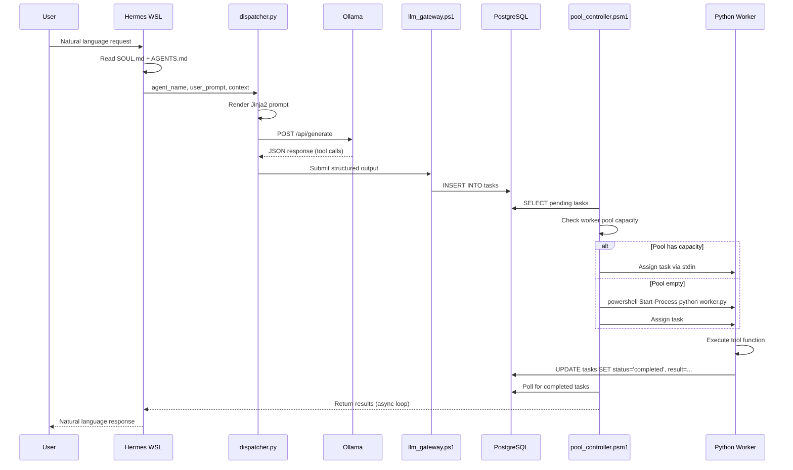

# RASA Architecture Overview

## Visual Data Flow

```
+----------------+     +------------------+     +---------------------+
|   User Input   |---->| Hermes (WSL)     |---->|  AGENTS.md rules    |
|  (CLI/Discord) |     |  reads SOUL.md   |     |  + SOUL.md context  |
+----------------+     +------------------+     +----------+----------+
                                                             |
                                        +--------------------v--------------------+
                                        |  agent_dispatcher.py                      |
                                        |  1. Parse agent def (model, system, etc)  |
                                        |  2. Render Jinja2 prompt                  |
                                        |  3. Call Ollama API (WSL -> localhost)    |
                                        |  4. Parse JSON output                     |
                                        +--------------------+--------------------+
                                                             |
                                        +--------------------v--------------------+
                                        |  llm_gateway.ps1 (Windows)                |
                                        |  - Wraps output into JSON envelope        |
                                        |  - Adds status, timestamp, worker_id    |
                                        +--------------------+--------------------+
                                                             |
                                        +--------------------v--------------------+
                                        |  PostgreSQL (Windows)                     |
                                        |  rasa_orch.tasks table                    |
                                        |  rasa_orch.worker_status table            |
                                        +--------------------+--------------------+
                                                             |
                                        +--------------------v--------------------+
                                        |  pool_controller.psm1 (Windows)           |
                                        |  - Reads DB tasks                           |
                                        |  - Manages worker pool (create/destroy)   |
                                        |  - Routes tasks to available workers      |
                                        +--------------------+--------------------+
                                                             |
                                        +--------------------v--------------------+
                                        |  Worker Processes (Python scripts)        |
                                        |  - Execute task.tool tasks               |
                                        |  - Write results back to DB              |
                                        +-----------------------------------------+
```

## Component Interaction Sequence



## Software Boundaries

| Layer | Technology | Responsibility |
|-------|-----------|----------------|
| Orchestrator | Hermes in WSL | Intent parsing, high-level reasoning, soul/agent config |
| Dispatch | Python 3.12 | Prompt rendering, LLM I/O, JSON validation |
| Gateway | PowerShell | Windows-side envelope wrapping, DB writes |
| Controller | PowerShell | Process lifecycle, worker pool, health checks |
| Workers | Python scripts | Tool execution, file I/O, external API calls |
| Persistence | PostgreSQL + Redis | Task queue, status, results, caching |
| LLM | Ollama | Local inference, tool-calling JSON output |

## Network Flow

```
WSL (Ubuntu)          Windows 11 Host          External
   |                        |                      |
   |  HTTP localhost:11434  |                      |
   +----------------------->|  Ollama (localhost)  |
   |  (works because WSL2   |                      |
   |   shares host network) |                      |
   |                        |                      |
   |  powershell.exe        |                      |
   +------------------------>+  psql (localhost)   |
   |  (interop bridge)      |  Redis (localhost)   |
   |                        |                      |
```

## Failure Domains

1. **Ollama unreachable** → dispatcher.py retries with exponential backoff, falls back to cached response or human escalation
2. **PostgreSQL connection refused** → llm_gateway.ps1 queues to Redis, db_writer worker drains queue when DB recovers
3. **Worker crash** → pool_controller detects non-zero exit, marks task failed, restarts worker
4. **JSON parse failure** → dispatcher.py validates schema against Pydantic model, returns validation error to orchestrator
5. **WSL interop broken** → Hermes detects powershell.exe failure, alerts user via TUI notification
