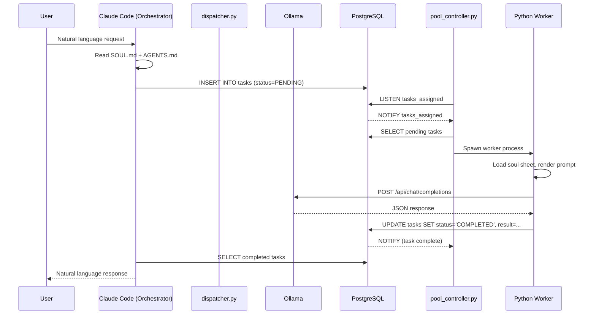

# RASA Architecture Overview

## Visual Data Flow

```
+----------------+     +------------------+     +---------------------+
|   User Input   |---->| Claude Code      |---->|  AGENTS.md rules    |
|  (CLI/Discord) |     | (Orchestrator)   |     |  + SOUL.md context  |
+----------------+     +------------------+     +----------+----------+
                                                             |
                                        +--------------------v--------------------+
                                        |  agent_dispatcher.py                      |
                                        |  1. Parse agent def (model, system, etc)  |
                                        |  2. Render prompt (Handlebars→Jinja2)     |
                                        |  3. Call Ollama API (localhost)           |
                                        |  4. Parse JSON output                     |
                                        +--------------------+--------------------+
                                                             |
                                        +--------------------v--------------------+
                                        |  PostgreSQL (localhost)                    |
                                        |  rasa_orch.tasks table                    |
                                        |  LISTEN/NOTIFY for wake-up                |
                                        +--------------------+--------------------+
                                                             |
                                        +--------------------v--------------------+
                                        |  pool_controller.py                       |
                                        |  - Polls tasks via PG LISTEN/NOTIFY       |
                                        |  - Spawns worker processes                |
                                        |  - Tracks heartbeats via Redis Pub/Sub    |
                                        +--------------------+--------------------+
                                                             |
                                        +--------------------v--------------------+
                                        |  Worker Processes (Python scripts)        |
                                        |  - Execute tool tasks                     |
                                        |  - Write results back to DB               |
                                        +-----------------------------------------+
```

## Component Interaction Sequence



## Software Boundaries

| Layer | Technology | Responsibility |
|-------|-----------|----------------|
| Orchestrator | Claude Code | Intent parsing, high-level reasoning, task creation, soul/agent config |
| Dispatch | Python 3.12+ | Prompt rendering, LLM I/O, JSON validation |
| Control Plane | Go 1.24+ (stubs) | Task lifecycle, pool management, policy, recovery, evaluation |
| Workers | Python scripts | Tool execution, file I/O, external API calls |
| Persistence | PostgreSQL + Redis | Task queue (PG), status, results, caching (Redis) |
| Messaging | PostgreSQL LISTEN/NOTIFY + Redis Pub/Sub | Durable task events (PG), ephemeral heartbeats/policy (Redis) |
| LLM | Ollama | Local inference via OpenAI-compatible API |

## Network Flow

```
All components run on a single Windows 11 machine:

  Claude Code (orchestrator) ─── PostgreSQL (localhost:5432)
       │                              │
       │                              ├── rasa_orch (tasks, deps, checkpoints)
       │                              ├── rasa_pool (agents, heartbeats)
       │                              ├── rasa_policy (rules, audit)
       │                              ├── rasa_memory (embeddings, cache)
       │                              ├── rasa_eval (evaluation records)
       │                              └── rasa_recovery (recovery state)
       │
       ├── Redis (localhost:6379) ─── heartbeats, session cache, policy Pub/Sub
       │
       ├── Ollama (localhost:11434) ── gemma4:31b-cloud, kimi-k2.6:cloud
       │
       └── Python workers (subprocess) ── agent dispatchers
```

## Failure Domains

1. **Ollama unreachable** → dispatcher.py retries with exponential backoff, task status → FAILED after max attempts
2. **PostgreSQL connection refused** → dispatcher exits with error code 255; pool controller logs backpressure event
3. **Worker crash** → pool controller detects heartbeat timeout (> 3× interval); task stays ASSIGNED, retry scheduled
4. **JSON parse failure** → dispatcher.py validates schema against Pydantic model, returns validation error
5. **Redis unavailable** → heartbeat silence triggers agent timeout in pool controller; agents recover on next heartbeat cycle when Redis returns; policy polling via PostgreSQL (30s) covers missed Pub/Sub messages
